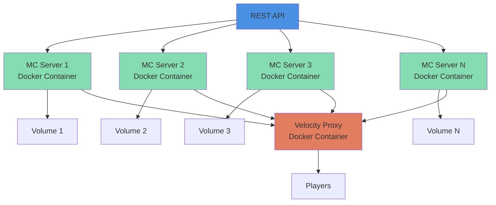

# Docker Minecraft Cloud Manager

> **Status:** Work in Progress

A cloud management platform for running and orchestrating Minecraft servers using Docker containers.

## Overview

Docker Minecraft Cloud Manager provides automated infrastructure for deploying and managing multiple Minecraft servers. Each server runs in an isolated Docker container with persistent storage, connected through a centralized Velocity proxy for seamless player routing.

## Features

- **Docker-based Architecture**: Each Minecraft server runs in an isolated container
- **Persistent Storage**: Volumes ensure world data persists across container restarts
- **Centralized Proxy**: Velocity proxy manages connections and routes players between servers
- **REST API**: Programmatic control for creating, managing, and monitoring servers
- **Network Isolation**: Secure Docker networking between servers and proxy

## Architecture



## Prerequisites

- Docker
- Docker Compose (optional, for orchestration)
- Go 1.25.4+

## Getting Started

### Installation

```bash
# Clone the repository
git clone https://github.com/mlhmz/dockermc-cloud-manager.git
cd dockermc-cloud-manager

# Build the project
go build
```

### Running the API

```bash
# Copy environment template
cp .env.example .env

# Build the API
go build -o bin/api ./cmd/api

# Run the API
./bin/api
```

The API server will start on `http://localhost:8080` by default.

## API Documentation

The REST API is documented using OpenAPI 3.0 specification. You can find the complete API documentation in `api/openapi.yaml`.

### Available Endpoints

- `GET /health` - Health check
- `POST /api/v1/servers` - Create a new Minecraft server
- `GET /api/v1/servers` - List all servers
- `GET /api/v1/servers/{id}` - Get server details
- `DELETE /api/v1/servers/{id}` - Delete a server
- `POST /api/v1/servers/{id}/start` - Start a server
- `POST /api/v1/servers/{id}/stop` - Stop a server

### Example: Create a Server

```bash
curl -X POST http://localhost:8080/api/v1/servers \
  -H "Content-Type: application/json" \
  -d '{
    "name": "survival-server",
    "max_players": 20,
    "motd": "Welcome to my server!",
    "version": "1.20.1"
  }'
```

### Viewing the API Documentation

**Interactive Swagger UI** (Built-in):
Once the API is running, visit `http://localhost:8080/swagger/` to view and interact with the API documentation through Swagger UI.

**Other Options**:
- **OpenAPI Spec**: `http://localhost:8080/api/openapi.yaml` - Raw YAML specification
- [Swagger Editor](https://editor.swagger.io/) - Paste the contents of `api/openapi.yaml`
- [Redoc](https://redocly.github.io/redoc/) - For a cleaner documentation view
- [Postman](https://www.postman.com/) - Import the OpenAPI spec for testing

## Development

### Project Structure

```
dockermc-cloud-manager/
├── README.md
├── go.mod
└── [source files to be added]
```

### Building from Source

```bash
go build -o dockermc-cloud-manager
```

## Roadmap

- [x] Core Docker container orchestration
- [x] Volume management for server persistence
- [x] Velocity proxy integration
- [x] Docker network configuration
- [x] REST API implementation
- [x] Server lifecycle management (create, start, stop, delete)
- [ ] Monitoring and logging
  - [ ] Actual healthchecks in server instances and proxy instance
- [ ] Configuration management

## Contributing

Contributions are welcome! Please feel free to submit a Pull Request.

## License

*License information to be added*

## Contact

- GitHub: [@mlhmz](https://github.com/mlhmz)
- Project: [dockermc-cloud-manager](https://github.com/mlhmz/dockermc-cloud-manager)
